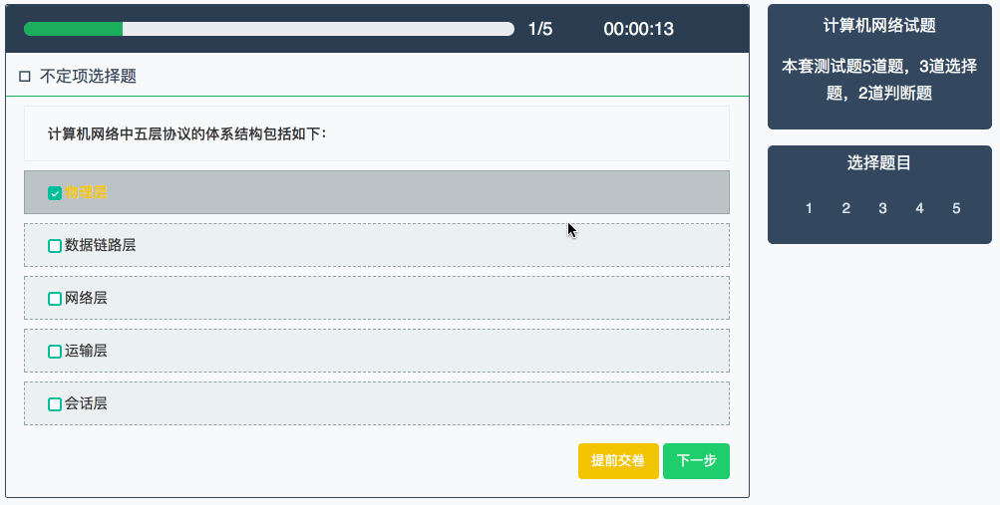

# jExam
A jQuery Plugin to Do Exam Question Online With Automatic Scoring.

## Demo Show


## Hello Word
* To use jExam, the following files should always be included. The file [jExam.css](https://github.com/chenfucaijun/jExam/blob/master/css/jExam.css) and [jExam.js](https://github.com/chenfucaijun/jExam/blob/master/js/jExam.js) is important!
* css
```
    <link href="https://cdn.bootcss.com/bootstrap/3.3.4/css/bootstrap.min.css" rel="stylesheet">
    <link href="https://cdn.bootcss.com/flat-ui/2.3.0/css/flat-ui.min.css" rel="stylesheet">
    <link rel="stylesheet" href="css/jExam.css">
```

* js dependencies
```
<script>
 <script src="https://code.jquery.com/jquery-2.2.4.min.js"></script>
 <script src="https://cdn.bootcss.com/bootstrap/3.3.4/js/bootstrap.min.js"></script>
 <script src="js/jExam.js"></script>
</script>
```

* In the html body, the div structure may be like the following:
```
<div class="question-area div-main-container">


</div>
```

* At last you could use your Exam data to replace default data ,and run jExam !
```
<script>

  var question_data = '{"id":"1","title":"计算机网络试题","introduction":"本套测试题5道题，3道选择题，2道判断题","user_create_id":"25","user_edit_id":"25","content":{"questions":{"unchoices":[{"q":"计算机网络中五层协议的体系结构包括如下：","a":["物理层","数据链路层","网络层","运输层","会话层"],"ta":["1","1","1","1","1"]},{"q":"数据链路层的作用包括:","a":["物理地址寻址","拥塞控制","数据的成帧","流量控制","数据的检错"],"ta":["1","1","1","0","1"]},{"q":"IP 地址的分类有","a":["B类地址：以0开头","B类地址：以10开头","C类地址：以110开头","C类地址：以1110开头"],"ta":["0","1","1","0"]}],"tf":[{"q":"RIP协议是一种路由选择协议","a":["正确","错误"],"ta":"1"},{"q":"UDP是面向连接的，不可靠的数据报服务","a":["正确","错误"],"ta":"0"}]}},"created_at":"2016-10-10 16:04:10","updated_at":"2016-10-10 16:04:10","deleted_at":null}';

  $(function () {
    $(".question-area").doquestion(question_data);
  });
</script>
```

## Exam Json Data Format
* You should insert question and answer in the JSON string! Like the following:
* meanings of json data
  * id: identified num
  * title: exam paper title
  * introduction: exam paper brief introduction
  * **unchoices**: Uncertain item choice question
  * q: question content
  * a: question option content
  * ta: true answer
    * 1 is true
    * 0 is wrong
  * **tf**: True or False question
```
{
    "id":"1",
    "title":"计算机网络试题",
    "introduction":"本套测试题5道题，3道选择题，2道判断题",
    "content":{
        "questions":{
            "unchoices":[
                {
                    "q":"计算机网络中五层协议的体系结构包括如下：",
                    "a":[
                        "物理层",
                        "数据链路层",
                        "网络层",
                        "运输层",
                        "会话层"
                    ],
                    "ta":[
                        "1",
                        "1",
                        "1",
                        "1",
                        "1"
                    ]
                },
                {
                    "q":"数据链路层的作用包括:",
                    "a":[
                        "物理地址寻址",
                        "拥塞控制",
                        "数据的成帧",
                        "流量控制",
                        "数据的检错"
                    ],
                    "ta":[
                        "1",
                        "1",
                        "1",
                        "0",
                        "1"
                    ]
                },
                {
                    "q":"IP 地址的分类有",
                    "a":[
                        "B类地址：以0开头",
                        "B类地址：以10开头",
                        "C类地址：以110开头",
                        "C类地址：以1110开头"
                    ],
                    "ta":[
                        "0",
                        "1",
                        "1",
                        "0"
                    ]
                }
            ],
            "tf":[
                {
                    "q":"RIP协议是一种路由选择协议",
                    "a":[
                        "正确",
                        "错误"
                    ],
                    "ta":"1"
                },
                {
                    "q":"UDP是面向连接的，不可靠的数据报服务",
                    "a":[
                        "正确",
                        "错误"
                    ],
                    "ta":"0"
                }
            ]
        }
    }
}
```

## License
See the [LICENSE](./LICENSE.md) file for license rights and limitations (MIT).

